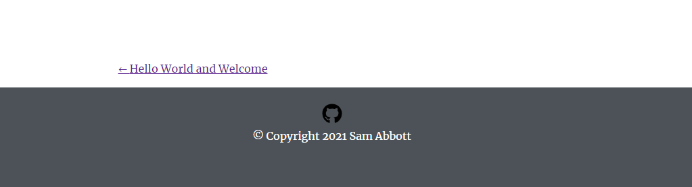

When I browse the web from my computer or mobile device, all websites seem to have a few things in common: they have a navigation bar, a footer, and pages containing interesting content. With each passing week, I am adding more content to Clicks to Code to meet the criteria of a website. For this weeks development update I have created a footer for my website.

### Footer Enhancement Idea

The footer requirements I have in mind are pretty basic:
1. It must be at the bottom of the view port if no content is present (no scroll bars present on the side of the screen)
2. If content is present, the footer must be at the bottom of the page and below the content (if scroll bars ARE present on the side of the screen)
3. A secondary color must be chosen that compliments the navigation bar
4. There must be an icon of github located in the footer
5. Clicking the icon should link the user to my personal github page
6. Beneath the github icon, there should be copywrite information

### Results of Development work

The footer was less complicated to work with in comparison to the navigation bar. I chose a complimentary gray color that goes along with the blueish color of the navigation bar. I centered the text and icon image using text-align: center;

For the icon, I used React Icons package to import a github icon into my footer component. I then configured the icon by importing InconContext into my footer, which allowed me to target and style the icon with CSS. 

The tricky part of this enhancement was getting the footer to stay at the bottom of the page. There are two scenarios to consider here: the footer must remain at the bottom of the screen when there is no content on the page AND the footer must remain at the bottom of the page when there is more content on the page than what the view port is able to display. In order to accomplish this task, I did the following:
- Using the Style.css file, I targeted both the Layout.js and footer.js components
- In Layout.js, I encompassed the header, main, and footer elements in a div element with a class name of main-layout-container
- Selecting the main-layout-container class, I set the min-height to "100vh" and set the position to relative; this will help keep the footer at the bottom of the page when there isn't enough content to fill the view port and it will allow me to position the child elements of main-layout-container sing top, bottom, left, and right
- With that last statement in mind, I set the footer, with id="footer1," to position:absolute; and set the bottom attribute to 0; this will keep footer at the bottom of the page if there is not enough content to fill the page, and it will keep the footer below the content if there is enough content to fill the view port
- Lastly, I gave the footer a static height of 150px to display my content, and I gave the main element a padding-bottom of 150px so there is no overlap between the footer and main elements

Here is a snippet of my footer.js structure:

    

        

            <a href=<link to my github>>
                <IconContext.Provider value={{className: "footer-github-icon"}}>
                    <FaGithub />
                </IconContext.Provider>
            </a>
        

        

            © Copyright {new Date().getFullYear()} Sam Abbott
        

    

My layout.js structure:

    

        <header>
            <Navbar location={location} title={title}></Navbar>
        </header>
        

            <main>{children}</main>
        

        <footer id="footer1">
            <Footer></Footer>
        </footer>
    

And lastly, my Style.css structure:

    .main-layout-container {
        min-height: 100vh;
        position: relative;
    }

    #footer1{
        position: absolute;
        bottom: 0;
        width: 100%;
        background-color:#4C5257;
        color: white;
        height: 150px;
        text-align: center;
    }

*No Content Footer*

*Content Footer*

### Lessons learned

Getting to use the position property to solve for the positioning of the footer element was a fun and interesting challenge to tackle. Going into this project, I had a brief understanding of the different positioning properties, but I feel like I have a better understanding of Relative and Absolute positoning now. To further my understanding of css positioning, I plan to do a whole post dedicated to this attribute.

The second item I learned more about it using React Icons. While it wasn't very difficult to implement, it is good to know that there is a library of icons I can use for future projects that is easy to implement and customize.