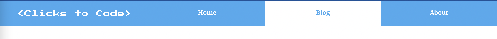
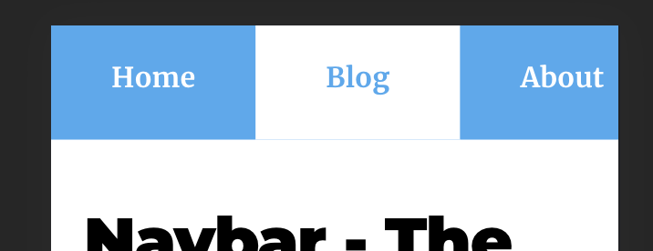

When I first started building Clicks to Code back in April 2021, my wife was pregnant with our first baby. I believed at the time that I could finish a basic version of Clicks to Code before the baby arrived… Well, I was wrong. Here is a much needed blog post entry after two months of learning how to be a dad!

### Enhancement Proposal

Now that Clicks to Code is live and *functioning,* it is time to create a styled navigation bar. The current navigation bar in Clicks to Code looks like this:

It is technically a navigation bar, but it is lacking style, responsiveness, and pre-loading of navigation items provided by Gatsby.

I have listed out my requirements below for a successful first navigation bar upgrade:

1. Styling
    - Choose color theme for the navbar
    - Update font for brand text
    - Update font for clickable links
    - Separate Brand from clickable buttons
    - Add state to buttons on mouse hover
    - When a button is clicked, it should be underlined or highlighted in some way so that the user knows what page they are on 
2. Functionality
    - Make the navbar responsive to size changes, similar to a bootstrap implementation
    - Button click should not require a full page reload, it should utilize gatsby routing to load all pages on first page load so that clicks are seamless
    - The mobile nabber should implement a hamburger stack that can be clicked and display clickable tab options

### Result of Development Work

The images below are the result of my development work:

*Desktop view of new navbar*

*Mobile view of new navbar*

For the styling, I chose sky blue as the main color for the navbar. Inactive tabs will remain sky blue and active tabs will have a white background to show state. I chose lime-green for the mouse hover color, which I thought could also be used for subtle highlights in the homepage, blog, and about me sections as well. I found a ridiculous pixelated font for the Clicks to Code branding and it is growing on me! I think it gives the site a fun and code centric feel. I didn’t change the font for the Home, Blog, and About tabs as I thought the standard text used is good enough for now. 

For the functionality piece, I used CSS flex to separate the Clicks to Code branding from the navigation items. What’s nice about flex box is that the tab sizes change with the size of the screen you are viewing them on. To accommodate smaller screens, I implemented a media query that will remove the navigation brand from the navigation bar so that the navigation itmes are the only tabs remaining. For the tab state functionality, I implemented Gatsby *IsActive* for the Home and About tabs, and partiallyActive to keep the Blog tab active when viewing blog posts. Lastly, I used Gatsby Link to replace the <a> tags for the Brand, Home, Blog, and About sections, which utilizes Gatsby to preload the page for faster loading times on mouse click.

I did try to implement a hamburger menu to keep the navigation branding up, but I was unsuccessful. I will discuss this more in the lessons learned section. 

Here is an example of Gatsby link in my code:

    

      <Link to="/" activeClassName={navbarStyles.active}>Home</Link>
      <Link to="/blogs/" activeClassName={navbarStyles.active} partiallyActive={true}>Blog</Link>
      <Link to="/about/" activeClassName={navbarStyles.active}>About</Link>
    

### Lessons Learned

Building the navigation bar opened my eyes to the complexity of CSS. While I was able to use CSS Modules to implement flex box and media queries to make my navbar responsive, I was not able to develop a hamburger menu due to limited understanding of css positioning rules. Going forward, I need to focus on understanding the basics of CSS Position, Flex, and Grid CSS properties at a depper level so that I can implement features like this in the future.

Another area that gave me some difficulties is with Google and the blog post urls in my project. In order to preserve state with my blog articles, I used ‘partiallyactive = true’ to show active state on the blog tab when blog articles are open. In order for partial active to work, I needed to append ‘/blog/‘ to each blog post url string, which is bad news because Google had already indexed my website articles without '/blog/' in the url string. This was an incredible valuable lesson learned that I won't forget going forward.

